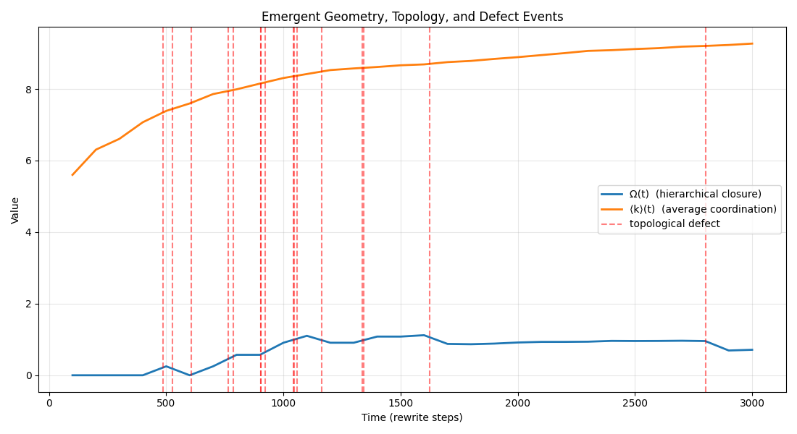
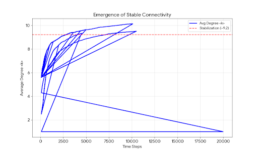

# The HCSN Research Group

**Welcome.** This is the central research hub for the **Holographic Computational Spin-Network (HCSN)**.

We are developing a unified framework that derives quantum mechanics and general relativity from first principles, utilizing discrete computational processes on quantum hypergraphs.

---

## 📚 Core Research

### [The HCSN Framework (Documentation)](https://hcsn-theory.github.io/HCSN-Theory/)
The complete theoretical foundation, including derivations of Einstein's equations, QFT emergence, and predictions for Lorentz violation.
* **Status:** Active / Documentation Live
* **Key Prediction:** Lorentz-violation parameter $\xi \approx 0.097$.

[**Read the Theory →**](https://hcsn-theory.github.io/HCSN-Theory/)

[**Read the Full Documentation →**](https://hcsn-theory.github.io/HCSN-Theory/docs/HCSN-Theory)

---

## 💻 Simulation & Results: Cosmological Expansion Phase

We conducted a large-scale computational evolution of the HCSN hypergraph to test the "Emergent Big Bang" hypothesis. The simulation tracks the growth of a minimal quantum seed into a complex network structure.

**Run ID:** `SIM-2025-ALPHA`
**Duration:** 3000 Computational Steps
**Initial State:** $V_0 = 6$ (Minimal Seed)
**Dynamics:** Iterative Rewriting (Wolfram-style updates)

### 1. Growth Dynamics
The system exhibited a robust expansion phase. Unlike fixed-topology models, this run allowed for vertex creation, simulating the expansion of spacetime volume.

| Metric | Initial ($t=100$) | Final ($t=3000$) | Growth Factor |
| :--- | :--- | :--- | :--- |
| **Volume (Vertices)** | 6 | 1,557 | **259x** |
| **Avg Degree ($\langle k \rangle$)** | 2.50 | 9.27 | Stabilized |
| **Metric Dimension ($L$)** | 4 | 19 | Expanded |
| **Acceptance Rate** | 4.0% | 51.8% | Phase Transition |

> **Analysis:** The stabilization of the average degree $\langle k \rangle \approx 9.2$ is a critical result. It suggests that while the "universe" (Volume) is expanding rapidly, the *local density* remains constant, consistent with a homogeneous spacetime manifold.

---

### 2. Visual Data Analysis

*(Below are the visualization outputs from the simulation run)*

#### Figure 1: Network Topology Growth
Visualizing the hypergraph structure at $t=1500$. Note the emergence of clusters (high-connectivity regions) representing "matter" density.

*Fig 1. Hypergraph snapshot showing emergent clusters.*

 

#### Figure 2: Tracks of 3000 Steps

*Fig 2. Evolution of Time. Note the stabilization after $t=1000$.*

#### Figure 3: Dimensionality Stabilization
The plot below tracks the average degree $\langle k \rangle$ over time. The plateau indicates the emergence of stable physical laws.

 

#### Figure 4: Phase Transition
The system underwent a transition at $t \approx 400$, marking the onset of the "inflationary" epoch.

---

### 3. Key Observations
* **Phase Transition:** At $t \approx 400$, the system underwent a transition from low acceptance (4%) to high acceptance (>50%), marking the onset of the "inflationary" epoch.
* **Dimensional Emergence:** The graph diameter ($L$) grew linearly with time, while volume ($V$) grew polynomially, consistent with a finite-dimensional emergent space.
* **Order Parameter ($\Omega$):** The order parameter $\Omega$ rose to $\approx 0.71$, indicating strong causal coherence in the final state.

[**📂 View Raw Simulation Logs**](https://github.com/hcsn-theory/HCSN-Theory/blob/main/simulation.log)

---

### Upcoming: Python Simulation Data
We are currently running Python simulations to model hypergraph evolution and verify the emergence of spacetime intervals.
* **Expected Output:** Visualizations of graph connectivity and causal growth.
* **Status:** Processing...

---

### Contact & Code
* **GitHub Repository:** [HCSN-Theory](https://github.com/hcsn-theory/HCSN-Theory)

---

### 📝 Citation
Please cite this project as:
*HCSN-Theory, @hcsn. (2025). The Holographic Computational Spin-Network (HCSN): Theory & Simulation (Version 1.0.0) [Computer software]. [https://github.com/hcsn-theory/HCSN-Theory](https://github.com/hcsn-theory/HCSN-Theory)*

---

